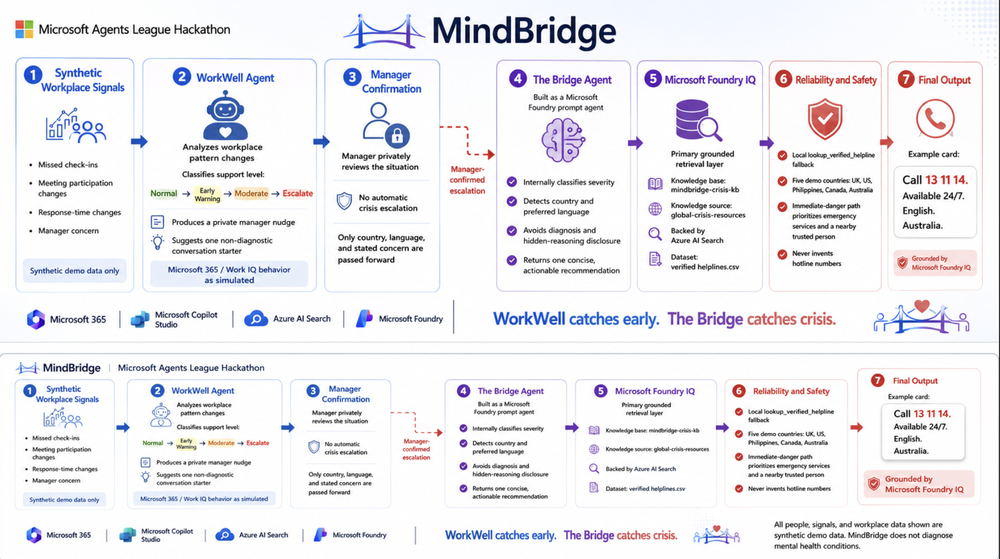

# MindBridge

### WorkWell catches early. The Bridge catches crisis.

[](https://ai.azure.com/)
[](https://www.python.org/)
[](https://streamlit.io/)
[](#testing)
[](LICENSE)

MindBridge is a safety-focused two-agent prototype built for the **Microsoft
Agents League Hackathon 2026** and **Men's Mental Health Month**. It reduces
the distance between an observable change at work and a verified source of
crisis support.

WorkWell helps a manager notice synthetic workplace-pattern changes and prepare
a private, non-diagnostic check-in. When a manager confirms that a situation
needs crisis-resource support, The Bridge Agent uses Microsoft Foundry IQ to
return one grounded, location-aware recommendation.

> **Important:** All people, signals, and workplace data shown are synthetic demo data. MindBridge does not diagnose mental health conditions.

> **Crisis notice:** MindBridge is a hackathon prototype, not a replacement for
> emergency services, professional medical advice, diagnosis, or treatment. If
> someone may be in immediate danger, contact local emergency services and stay
> near a trusted person.

## Architecture

The system separates workplace support from crisis-resource retrieval. Team
telemetry is never sent to The Bridge Agent. Only a manager-confirmed country,
preferred language, and stated concern cross the escalation boundary.



<p align="center"><em>WorkWell catches early. The Bridge catches crisis.</em></p>

```text
Synthetic workplace signals
        |
        v
WorkWell Agent -> Private manager review
                         |
                         | Manager-confirmed escalation
                         v
                  The Bridge Agent
                         |
                         v
          Microsoft Foundry IQ knowledge base
                         |
                         v
             One verified recommendation

Fallback: lookup_verified_helpline
Urgent path: local immediate-danger guidance
```

## The Two Agents

### WorkWell Agent

WorkWell demonstrates an early-support workflow using six fictional,
first-name-only employee profiles. It:

- Assesses consented synthetic signals such as missed check-ins, meeting
  participation changes, response-time changes, and manager concern
- Groups results as **Normal**, **Early Warning**, **Moderate**, or **Escalate**
- Produces a private manager nudge and one conversation starter
- Suggests private check-ins without diagnosis or mental-health ranking
- Requires manager confirmation before any Bridge handoff

The Microsoft 365, Teams, and Work IQ behavior shown in this prototype is
**simulated**. No real employee records, messages, calendars, emails, company
data, or personally identifiable information are used.

### The Bridge Agent

The Bridge Agent is a versioned Microsoft Foundry prompt agent that:

1. Receives a country, preferred language, and stated concern
2. Classifies severity internally without exposing hidden reasoning
3. Queries the attached Foundry IQ knowledge base
4. Validates the result against the reviewed country record
5. Returns one concise, actionable crisis-resource recommendation

For immediate-danger language, the application bypasses network retrieval,
prioritizes the country's emergency service when known, and encourages the
person to move near someone they trust.

## Microsoft IQ Integration

**MindBridge uses Microsoft Foundry IQ as the Microsoft IQ layer for grounded
crisis-resource retrieval.**

| Component | Configuration |
|---|---|
| Foundry agent | `MindBridge` |
| Knowledge base | `mindbridge-crisis-kb` |
| Knowledge source | `global-crisis-resources` |
| Search layer | Azure AI Search |
| Demonstration dataset | [`data/helplines.csv`](data/helplines.csv) |

The primary retrieval path is:

```text
User -> Bridge Agent -> Foundry IQ -> Azure AI Search
     -> verified helpline record -> safe recommendation
```

If Foundry IQ fails, times out, or returns no usable match, the agent calls the
local `lookup_verified_helpline` function. It never invents a service or phone
number.

## Demonstration Coverage

The reviewed demonstration dataset currently covers:

| Country | Organization | Number | Availability |
|---|---|---:|---|
| United Kingdom | Samaritans | 116 123 | 24/7 |
| United States | 988 Suicide & Crisis Lifeline | 988 | 24/7 |
| Philippines | NCMH Crisis Hotline | 1553 | 24/7 |
| Canada | Talk Suicide Canada | 988 | 24/7 |
| Australia | Lifeline Australia | 13 11 14 | 24/7 |

This five-country dataset demonstrates the grounded retrieval and fallback
contract. It is not presented as a complete global crisis-resource directory.

## Safety and Privacy

- No diagnosis, treatment recommendation, or hidden chain-of-thought disclosure
- No automatic escalation from workplace telemetry
- No employee mental-health scores or ranked lists
- No real names, emails, employee IDs, employers, Teams messages, or calendars
- Minimal Bridge handoff containing only country, language, and stated concern
- Verified-number validation before a recommendation is shown
- Deterministic local fallback for retrieval failures
- Immediate-danger handling that does not depend on a network request
- Unsupported locations never receive a guessed hotline number

## Demo Flow

1. Open **Team Overview** to see grouped synthetic workplace support signals.
2. Choose **Review privately** for a fictional team member.
3. Run the private WorkWell assessment.
4. Review the evidence summary, manager nudge, and conversation starter.
5. Confirm an escalation-level handoff.
6. Enter the country, preferred language, and concern.
7. The Bridge Agent returns one recommendation labeled as Foundry IQ grounded
   or local verified fallback.
8. Use **Reset demo** to repeat the presentation.

## Technology

- Python 3.14
- Streamlit
- Microsoft Foundry prompt agents
- Microsoft Foundry IQ
- Azure AI Search
- Azure AI Projects SDK
- Azure Identity with `DefaultAzureCredential`
- OpenAI Responses API through `get_openai_client()`

## Run Locally

### Prerequisites

- Python 3.14
- An Azure account with access to the configured Foundry project
- Azure CLI authentication
- A Foundry agent with the attached Foundry IQ knowledge base

### Installation

```bash
git clone https://github.com/JD-dv/MindBridge-Agents-League.git
cd MindBridge-Agents-League

python -m venv .venv
source .venv/bin/activate
pip install -r requirements.txt
cp .env.example .env
```

Fill `.env` with your own Foundry project and knowledge-base configuration.
Never commit that file.

Authenticate with Azure:

```bash
az login
```

### Start the Dashboard

```bash
streamlit run app.py
```

Open `http://localhost:8501` in a browser.

### Run the Bridge CLI

Provision a new version of the configured prompt agent when needed:

```bash
python bridge_agent.py --provision
```

Reuse the existing agent during normal runs:

```bash
python bridge_agent.py
```

## Testing

The unit and dashboard tests use mocked Foundry clients and do not require live
Azure access:

```bash
python -m unittest discover -s tests -v
```

Current result: **46 tests passing**.

Coverage includes:

- WorkWell scoring thresholds and manager coaching
- Synthetic team aggregation and private-review loading
- Minimal manager-confirmed Bridge handoff
- Foundry IQ retrieval and timeout fallback
- Supported and unsupported countries
- Malformed tool calls and unverified model output
- Immediate-danger behavior and non-invented numbers
- Dashboard labels, privacy language, and repeatable demo state

## Project Structure

```text
MindBridge-Agents-League/
├── app.py                    # Streamlit dashboard and demo workflow
├── bridge_agent.py           # Foundry Bridge service and interactive CLI
├── workwell_agent.py         # Synthetic team assessment and coaching logic
├── data/
│   └── helplines.csv         # Reviewed five-country demonstration dataset
├── assets/
│   └── mindbridge-architecture.png
├── tests/
│   ├── test_app.py
│   ├── test_bridge_agent.py
│   └── test_workwell_agent.py
├── .env.example              # Safe configuration template
├── requirements.txt
└── LICENSE
```

## Hackathon Alignment

| Judging area | MindBridge approach |
|---|---|
| Accuracy and relevance | Foundry IQ grounding plus reviewed-number validation |
| Reasoning | Severity, location, language, support-level, and fallback decisions |
| Reliability and safety | Immediate-danger path, no invented numbers, tested fallback |
| Creativity | Prevention-to-crisis collaboration across two focused agents |
| User experience | Teams-inspired dashboard with one clear next action |
| Microsoft IQ | Foundry IQ knowledge-base retrieval backed by Azure AI Search |

## Current Prototype Boundaries

- WorkWell uses synthetic data and does not connect to a live Microsoft 365 tenant.
- The local fallback covers five demonstration countries.
- The Streamlit interface is a local hackathon prototype, not a production
  healthcare or emergency-response service.
- Production deployment would require broader resource governance, clinical
  review, localization, monitoring, consent controls, and security assessment.

## License

Released under the [MIT License](LICENSE).

---

Built by **Demosthenes C. Dejolde jr** for the Microsoft Agents League
Hackathon 2026.
